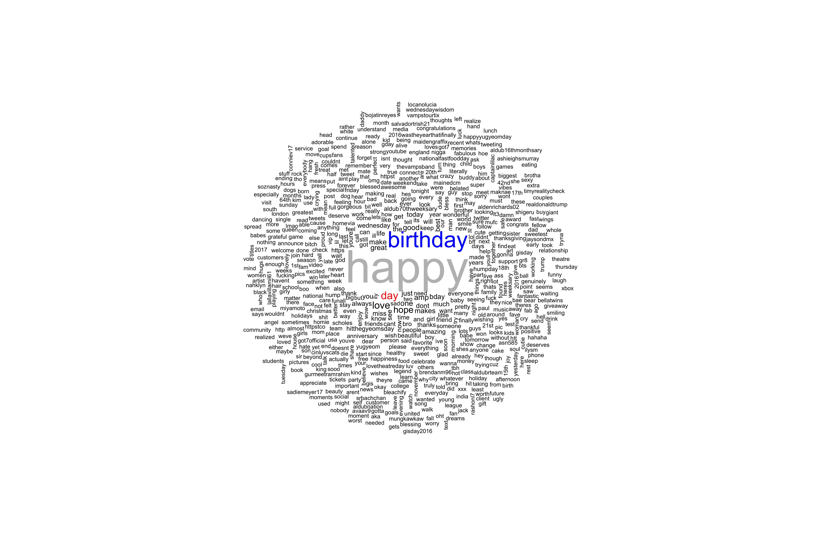

# mood-analysis
Using R to generate frequency-based word clouds for happy and sad tweets.

# Motivation
I wanted to analyze tweets containing the word "happy" and "sad" and see the words commonly associated with these feelings.

# Requirements

- rtweet

- wordcloud

# Getting Started

Ensure you have rtweet and wordcloud installed. If you don't, run the following:

```
install.packages("rtweet")
install.packages("wordcloud")
```

[Create a Twitter app](https://apps.twitter.com/app/new), and fill in the "app", "consumer_key", and "consumer_secret" in the create_token function. Then, you can run it.

# Results


